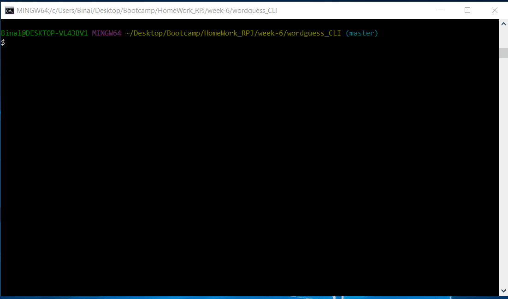

### wordguess_CLI

Welcome to Word Guess. Word Guess is a colorful CLI-based word guessing game. You can use this to guess a word from Netflix famous web series Stranger Things Characters.

Getting Started
To install on your local machine, run the following in your terminal:

$ npm install

* if you want to change the Array of words with different topic you can do it by following steps into your index.js file:

    *  change the wordlist array with your own words 
 
        e.g  var array = ['string1', 'string2', 'string3', 'string4'];
 

###Things to note

Arrays may only consist of alphabetic strings with capital characters spaces in a string can be allowed.

##Game Play

1.   To Run the game use below command

        node index.js
      
2.   Users will first be greeted with an instruction that you have 8 Guesses left to find the right word to win the game.

3.   Users may only enter one uppercase letter. If a user enters numbers, special characters, lowercase letters or multiple letters they will see an  message instructing that you miss one chance to guess

4.  When a user guesses all the letters of a word correctly, the game continues with new word guess.

5.  If a users guesses all of the words correctly, they will be shown a message saying they have guesed all the words correctly and the application will exit back to the terminal. Win_Game

6. User can make 8 mistakes when guessing letters, they will lose the game 

Below are some examples of what typical game play may look like.

